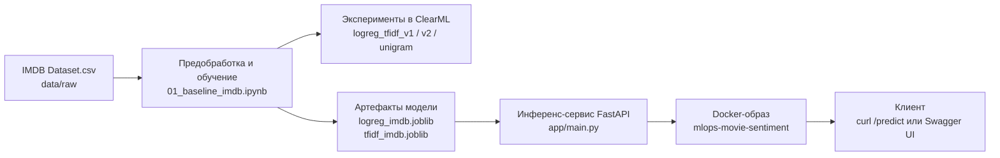

# **IMDB Sentiment Analysis — MLOps Pipeline (FastAPI + Docker + ClearML)**

Курсовой проект по дисциплине **«Операционализация моделей машинного обучения»**.

Цель работы — построить полноценный MLOps-процесс вокруг задачи анализа тональности отзывов о фильмах (Sentiment Analysis):
обучение модели → трекинг экспериментов → сохранение артефактов → запуск инференс-сервиса → контейнеризация.

---

# 🚀 **1. Архитектура проекта**

```
mlops_movie_sentiment/
│
├── app/                    # FastAPI сервис
│   ├── __init__.py
│   └── main.py
│
├── configs/
│   └── config.yaml         # Настройки train и inference
│
├── models/                 # Сохранённые артефакты (модель + TF-IDF)
│   ├── logreg_imdb.joblib
│   └── tfidf_imdb.joblib
│
├── notebooks/
│   └── 01_baseline_imdb.ipynb
│
├── data/
│   └── raw/IMDB Dataset.csv
│
├── Dockerfile
├── requirements.txt
├── MODEL_CARD.md
├── DATASET_CARD.md
└── README.md
```

---

# 🔧 **2. Функциональные компоненты проекта**

### ✔ **Модель**

* Logistic Regression
* TF-IDF векторизация
* Метрика: Accuracy ≈ **0.87–0.90** (в зависимости от конфигурации)

### ✔ **Эксперименты**

Трекинг с помощью **ClearML**:

* 3 эксперимента с разными гиперпараметрами
* 2 версии препроцессинга (unigram + bigram)
* Автоматический логинг: метрики, конфиг, confusion matrix, артефакты модели

### ✔ **Инференс-сервис**

FastAPI + Swagger UI
Эндпоинты:

* `GET /health` — проверка статуса
* `POST /predict` — предсказание тональности отзыва

### ✔ **Контейнеризация**

* Dockerfile на `python:3.10-slim`
* Модель и векторизатор копируются в образ
* Старт сервиса одной командой

---

# ⚙️ **3. Установка и запуск локально**

## 🔹 3.1 Установка зависимостей

```bash
pip install -r requirements.txt
```

## 🔹 3.2 Запуск FastAPI сервиса локально

```bash
uvicorn app.main:app --reload --host 0.0.0.0 --port 8000
```

Проверка:

* [http://127.0.0.1:8000/health](http://127.0.0.1:8000/health)
* [http://127.0.0.1:8000/docs](http://127.0.0.1:8000/docs) (Swagger)

---

# 🐳 **4. Запуск в Docker**

## 🔹 4.1 Сборка образа

```bash
docker build -t mlops-movie-sentiment .
```

## 🔹 4.2 Запуск контейнера

```bash
docker run --rm -p 8008:8000 mlops-movie-sentiment
```

Проверка:

```bash
curl http://127.0.0.1:8008/health
```

Предсказание:

```bash
curl -X POST "http://127.0.0.1:8008/predict" \
  -H "Content-Type: application/json" \
  -d '{"review": "Amazing movie! Loved every moment."}'
```

---

# 📊 **5. Эксперименты в ClearML**

В проекте проведены 3 эксперимента:

| Эксперимент              | max_features | ngram_range | preprocessing_version |
| ------------------------ | ------------ | ----------- | --------------------- |
| logreg_tfidf_v1          | 5000         | (1,2)       | tfidf_v1              |
| logreg_tfidf_v2_max10000 | 10000        | (1,2)       | tfidf_v2              |
| logreg_tfidf_unigram     | 5000         | (1,1)       | unigram_v1            |

Логируется:

* accuracy
* classification_report
* confusion matrix
* артефакты модели
* конфигурация

Скриншоты ClearML добавляются в отчёт.

---

# 🧩 **6. Конфигурация проекта (config.yaml)**

Проект использует единый YAML-файл:

```yaml
train:
  random_state: 42
  test_size: 0.2

  vectorizer:
    max_features: 5000
    ngram_range: [1, 2]
    stop_words: "english"

  model:
    type: "LogisticRegression"
    max_iter: 1000
    n_jobs: -1

  data:
    path: "data/raw/IMDB Dataset.csv"
    source: "Kaggle"

inference:
  model_path: "models/logreg_imdb.joblib"
  vectorizer_path: "models/tfidf_imdb.joblib"
```

FastAPI использует **inference** секцию.

---

# 📄 **7. Model Card & Dataset Card**

* **MODEL_CARD.md** — архитектура, метрики, ограничения
* **DATASET_CARD.md** — происхождение данных, лицензия, описание сплитов

Оба файла находятся в корне проекта.

---

# 🧪 **8. Быстрый пример использования API**

```bash
POST /predict
{
  "review": "The movie was terrible, boring and slow."
}

Результат:
{
  "sentiment": "negative",
  "positive_proba": 0.03,
  "negative_proba": 0.97
}
```

---

# 🏁 **9. Итоги**

Проект демонстрирует полный цикл MLOps вокруг NLP-модели:

* предобработка данных
* обучение модели
* эксперименты в ClearML
* сохранение артефактов
* инференс-сервис на FastAPI
* контейнеризация через Docker
* конфигурация через YAML

# **10. Пайплайн**

## 2.1. Схема пайплайна


